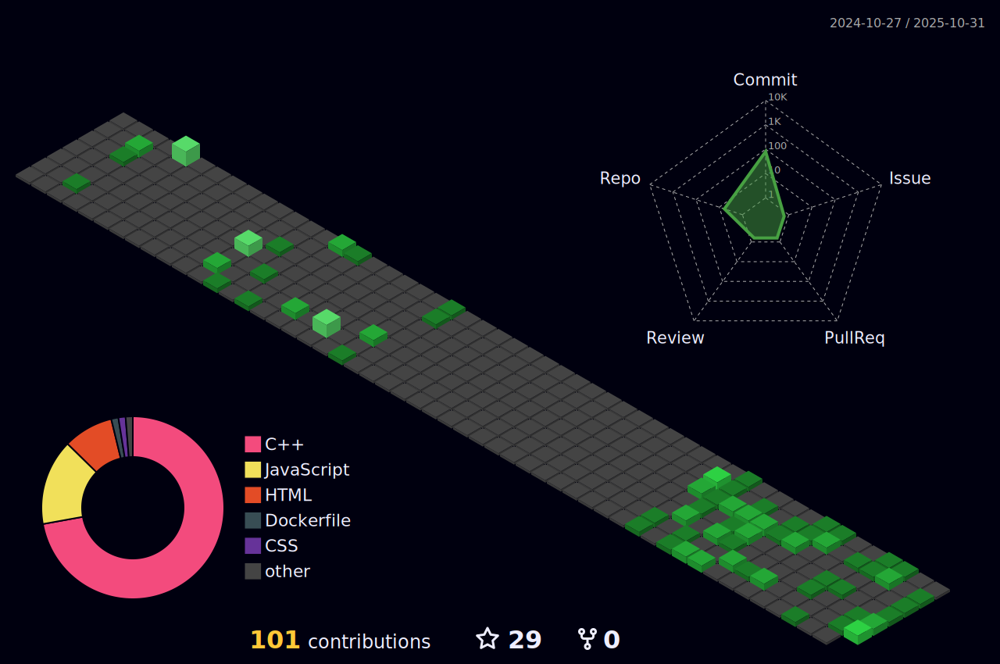

## ABOUT ME
Hello there! 👋 I'm Nishtha Aggarwal, a passionate and versatile software developer with expertise in HTML, CSS, JavaScript, Java, and React. I have a strong foundation in web development, front-end design, and backend programming, with a focus on creating intuitive and user-friendly applications.

I am currently pursuing BTech CSE from Manav Rachna University, where I gained a solid understanding of software development principles, algorithms, data structures, and software engineering best practices.

## SKILLS

- Frontend Development: HTML5, CSS3, JavaScript (ES6+), React.js, Bootstrap
- Backend Development: Java
- Database Management: MySQL, MongoDB
- Version Control: Git, GitHub
- UI/UX Design: Responsive Design, User Interface Prototyping
- Other Tools: Visual Studio Code, IntelliJ IDEA, npm

## Tech Stacks 🚀

Here are some of the technologies I enjoy working with:

### Programming Languages
 

### Web Development
    

### Front-End

### Back-End

### Databases
 [MySQL](https://img.icons8.com/?size=80&id=rgPSE6nAB766&format=png)
# 📊 GitHub Status:
 

 

## 🏆 GitHub Trophies

### 🔝 Top Contributed Repo

<!---
nishthaaggarwal15/nishthaaggarwal15 is a ✨ special ✨ repository because its `README.md` (this file) appears on your GitHub profile.
You can click the Preview link to take a look at your changes.
--->
